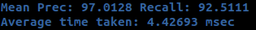
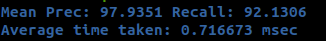

## Patchwork CUDA

This repository contains the CUDA implementation of Patchwork. 
Official implementation and research details
can be found [here](https://github.com/LimHyungTae/patchwork).

Only the Offline KITTI Dataset node is implemented in this repository,
but the class interface is kept pretty much the same. Just pass the point type
of your point cloud to the `Patchwork` class, and it should work.

Tested on:
- Ubuntu 20.04
- CUDA 11.8
- ROS Noetic
- NVIDIA GeForce RTX 3080 Ti Laptop 
- 12th Gen Intel i7-12700H

**~6.2x faster than CPU implementation.**

**Official TBB Parallelized Implementation**



**CUDA Implementation**
```
cd <YOUR_CATKIN_WS>
catkin build patchwork_cuda
source devel/setup.bash
roslaunch patchwork_cuda offline_kitti_gpu.launch
```




### Prepare Offline KITTI dataset

1. Download [SemanticKITTI](http://www.semantic-kitti.org/dataset.html#download) Odometry dataset (We also need labels since we also open the evaluation code! :)

2. Set the `data_path` in `launch/workbench.launch` for your machine.

The `data_path` consists of `velodyne` folder and `labels` folder as follows:

```
data_path (e.g. 00, 01, ..., or 10)
_____velodyne
     |___000000.bin
     |___000001.bin
     |___000002.bin
     |...
_____labels
     |___000000.label
     |___000001.label
     |___000002.label
     |...
_____...
```